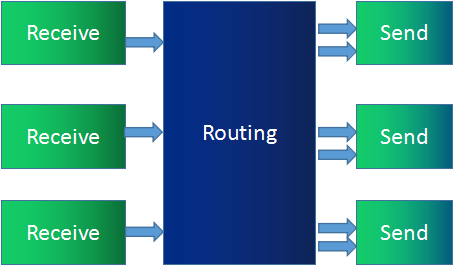

# Server

## 配置 HTTPS

mkcert 是一个用于生成本地自签名 SSL 证书的开源工具，项目基于 Golang 开发，可跨平台使用，不需要配置，支持多域名以及自动信任 CA。

安装 [mkcert](https://github.com/FiloSottile/mkcert) [https://github.com/FiloSottile/mkcert]

接着执行如下指令生成 HTTPS 证书

```bash
./mkcert.exe localhost 127.0.0.1 ::1
```

其中 localhost+2.pem 为 公钥， localhost+2-key.pem 为私钥

在 Fastify 中使用 HTTPS 证书

```javascript
const fastify = Fastify({
	// https证书
	https: {
		cert: readFileSync(join(__dirname, '../lib/localhost+2.pem')),
		key: readFileSync(join(__dirname, '../lib/localhost+2-key.pem')),
	},
})
```

这样就配置完成了，后面服务器就会使用 https 服务了

## Fastify 配置 ip 访问

添加 ip `0.0.0.0`

```javascript
fastify.listen({ host: '0.0.0.0', port: 8080 })
```

# 流媒体服务器

## SFC

SFU 像是一个媒体流路由器，接收终端的音视频流，根据需要转发给其他终端。SFU 在音视频会议中应用非常广泛，尤其是 WebRTC 普及以后。支持 WebRTC 多方通信的媒体服务器基本都是 SFU 结构。SFU 的拓扑机构和功能模型如下图：


在上图中，B1、B2、B3、B4 分别代表 4 个浏览器，每一个浏览器都会共享一路流发给 SFU，SFU 会将每一路流转发给共享者之外的 3 个浏览器。

下面这张图是从 SFU 服务器的角度展示的功能示意图：



相比 MCU，SFU 在结构上显得简单很多，只是接收流然后转发给其他人。然而，这个简单结构也给音视频传输带来了很多便利。比如，SFU 可以根据终端下行网络状况做一些流控，可以根据当前带宽情况、网络延时情况，选择性地丢弃一些媒体数据，保证通信的连续性。

目前许多 SFU 实现都支持 SVC 模式和 Simulcast 模式，用于适配 WiFi、4G 等不同网络状况，以及 Phone、Pad、PC 等不同终端设备。

### Simulcast 模式

所谓 Simulcast 模式就是指视频的共享者可以同时向 SFU 发送多路不同分辨率的视频流（一般为三路，如 1080P、720P、360P）。而 SFU 可以将接收到的三路流根据各终端的情况而选择其中某一路发送出去。例如，由于 PC 端网络特别好，给 PC 端发送 1080P 分辨率的视频；而移动网络较差，就给 Phone 发送 360P 分辨率的视频。

Simulcast 模式对移动端的终端类型非常有用，它可以灵活而又智能地适应不同的网络环境。下图就是 Simulcast 模式的示意图：


### SVC 模式

SVC 是可伸缩的视频编码模式。与 Simulcast 模式的同时传多路流不同，SVC 模式是在视频编码时做“手脚”。

它在视频编码时将视频分成多层——核心层、中间层和扩展层。上层依赖于底层，而且越上层越清晰，越底层越模糊。在带宽不好的情况下，可以只传输底层，即核心层，在带宽充足的情况下，可以将三层全部传输过去。

如下图所示，PC1 共享的是一路视频流，编码使用 SVC 分为三层发送给 SFU。SFU 根据接收端的情况，发现 PC2 网络状况不错，于是将 0、1、2 三层都发给 PC2；发现 Phone 网络不好，则只将 0 层发给 Phone。这样就可以适应不同的网络环境和终端类型了。


## Medooze

Medooze 是一款综合流媒体服务器，它不仅支持 WebRTC 协议栈，还支持很多其他协议，如 RTP、RTMP 等。其源码地址为：https://github.com/medooze/media-server 。

下面我们来看一下 Medooze 的架构图：


从大的方面来讲，Medooze 支持 RTP/RTCP、SRTP/SRCP 等相关协议，从而可以实现与 WebRTC 终端进行互联。除此之外，Medooze 还可以接入 RTP 流、RTMP 流等，因此你可以使用 GStreamer/FFmpeg 向 Medooze 推流，这样进入到同一个房间的其他 WebRTC 终端就可以看到 / 听到由 GStream/FFmpeg 推送上来的音视频流了。另外，Medooze 还支持录制功能，即上图中的 Recorder 模块的作用，可以通过它将房间内的音视频流录制下来，以便后期回放。

为了提高多方通信的质量，Medooze 在音视频的内容上以及网络传输的质量上都做了大量优化。关于这些细节我们这里就不展开了，因为在后面的文章中我们还会对 Medooze 作进一步的讲解。

以上我们介绍的是 Medooze 的核心层，下面我们再来看看 Medooze 的控制逻辑层。Medooze 的控制逻辑层是通过 Node.js 实现的，Medooze 通过 Node.js 对外提供了完整的控制逻辑操作相关的 API，通过这些 API 你可以很容易的控制 Medooze 的行为了。

通过上面的介绍，我们可以知道 Medooze 与 Mediasoup 相比，两者在核心层实现的功能都差不多，但 Medooze 的功能更强大，包括了录制、推 RTMP 流、播放 FLV 文件等相关的操作，而 Mediasoup 则没有这些功能。

不过 Medooze 也有一些缺点，尽管 Medooze 也是 C++ 开发的流媒体服务务器，使用了异步 IO 事件处理机制，但它使用的异步 IO 事件处理的 API 是 poll，poll 在处理异步 IO 事件时，与 Linux 下最强劲的异步 IO 事件 API epoll 相比要逊色不少，这导致它在接收 / 发送音视频包时性能比 Mediasoup 要稍差一些。

### Medooze 的使用

> 注意：Medooze 只能在 Linux 或 Mac OS 中编译使用，Windows 的话，请使用 WSL

一些必要的环境自行进行配置

接着按照下面指令安装运行

```bash
# 下载 SFU 代码
git clone https://github.com/medooze/sfu.git
# 安装 SFU 依赖
cd sfu
npm install
# 生成自签名证书
openssl req -sha256 -days 3650 -newkey rsa:1024 -nodes -new -x509 -keyout server.key -out server.cert
# 启动服务
node index.js IP
```

接着我们就可以通过 `https://IP:8084/index.html`来访问 Demo 了

## Mediasoup

Mediasoup 是推出时间不长的 WebRTC 流媒体服务器开源库，其地址为：https://github.com/versatica/mediasoup/ 。

Mediasoup 由应用层和数据处理层组成。应用层是通过 Node.js 实现的；数据处理层由 C++ 语言实现，包括 DTLS 协议实现、ICE 协议实现、SRTP/SRTCP 协议实现、路由转发等。

下面我们来看一下 Mediasoup 的架构图，如下所示：


Mediasoup 把每个实例称为一个 Worker，在 Worker 内部有多个 Router，每个 Router 相当于一个房间。在每个房间里可以有多个用户或称为参与人，每个参与人在 Mediasoup 中由一个 Transport 代理。换句话说，对于房间（Router）来说，Transport 就相当于一个用户。

Transport 有三种类型，即 WebRtcTransport、PlainRtpTransport 和 PipeTransport。

WebRtcTransport 用于与 WebRTC 类型的客户端进行连接，如浏览器。
PlainRtpTransport 用于与传统的 RTP 类型的客户端连接，通过该 Transport 可以播放多媒体文件、FFmpeg 的推流等。
PipeTransport 用于 Router 之间的连接，也就是一个房间中的音视频流通过 PipeTransport 传到另一个房间。
在每个 Transport 中可以包括多个 Producer 和 Consumer。

- Producer 表示媒体流的共享者，它又分为两种类型，即音频的共享者和视频的共享者。
- Consumer 表示媒体流的消费者，它也分为两种类型，即音频的消费者和视频的消费者。
- Mediasoup 的实现逻辑非常清晰，它不关心上层应用该如何做，只关心底层数据的传输，并将它做到极致。

Mediasoup 底层使用 C++ 开发，使用 libuv 作为其异步 IO 事件处理库，所以保证了其性能的高效性。同时它支持了几乎所有 WebRTC 为了实时传输做的各种优化，所以说它是一个特别优秀的 WebRTC SFU 流媒体服务器。

所以对于想学习 WebRTC 流媒体服务器源码的同学来说，Mediasoup 是一个非常不错的项目。

另外，对于开发能力比较强的公司来说，根据自己的业务需要在 Mediasoup 上做二次开发也是非常值得推荐的技术方案。

## Mediasoup 的使用

使用的结构：


### server 端

先创建 Worker 和 Router，同时还要将 router 支持的 RTP 类型传输给 client

```javascript
const mediasoupWorker = await mediasoup.createWorker({
	logLevel: config.mediasoup.worker.logLevel,
	logTags: config.mediasoup.worker.logTags,
	rtcMinPort: config.mediasoup.worker.rtcMinPort,
	rtcMaxPort: config.mediasoup.worker.rtcMaxPort,
})
const mediasoupRouter = await mediasoupWorker.createRouter({ mediaCodecs: config.mediasoup.router.mediaCodecs })

// 支持的RTP类型
mediasoupRouter.rtpCapabilities
```

后面都是两端相互联动创建连接，创建 WebRtcTransport

```javascript
const transport = await mediasoupRouter.createWebRtcTransport(option)
return {
	transport,
	params: {
		id: transport.id,
		iceParameters: transport.iceParameters,
		iceCandidates: transport.iceCandidates,
		dtlsParameters: transport.dtlsParameters,
	},
}
```

注意返回值，transport 是一个 WebRtcTransport 实例，用于与客户端的 transport 建立连接，以便后续流媒体的传输

transport 的实例需要保存，而 params 参数是传输给客户端，这样客户端就知道服务器创建了的 transport，就可以将两个 transport 建立连接了

接下来是 producer ，用于将客户端的音视频传输通过 transport 传输给 mediasoup 服务器

> 注意一个 producer 只对应与一种流媒体类型，即要么音频，要么视频

当 client 调用 produce()方法后，服务端创建 producer 来接受它的数据并传入给 router，用于后面 consumer 分配

服务端创建 producer

```javascript
// kind: audio / video
const producer = await producerTransport.produce({ kind, rtpParameters })
```

最后是 consumer， 用于将客户端传输给 mediasoup 服务器 的数据发送给客户端

当 client 调用 consume()方法后，指定要接受数据的 producer 的 id，服务端创建 consumer 来接受它的数据并传入给 client

```javascript
const consumer = await consumerTransport.consume({
	producerId: producer.id,
	rtpCapabilities,
	paused: producer.kind === 'video',
})
```

### client 端

首先加载 device 数据，查看服务器支持的类型

```javascript
const device = new mediasoup.Device()
// 使用mediasoup路由器的RTP功能加载设备
await device.load({ routerRtpCapabilities })
```

接着创建 Send Transport，用于将自己的音视频传输给服务器

创建的同时，服务器也创建对应 transport，并与之建立连接

```javascript
// 创建一个新的webbrtc传输来发送媒体。传输必须事先通过router.createwebrtctransport()在mediasoup路由器中创建
const transport = device.createSendTransport(data)
```

接下来，我们就可以通过 produce()方法将本地音视频传输给服务器的 producer 了

```javascript
const stream = await navigator.mediaDevices.getDisplayMedia({ video: true })
const track = stream.getVideoTracks()[0]
await transport.produce({ track })
```

最后建立上连接之后，就可以把 stream 传给 video 了

consume() 是一样的，先创建 Recv Transport，并建立 transport 的连接

```javascript
const transport = device.createRecvTransport(data)
```

接着通过 consume()，接收到对应的 producer 的流媒体，再获取到音视频 track 就可以传输到 video 中了
